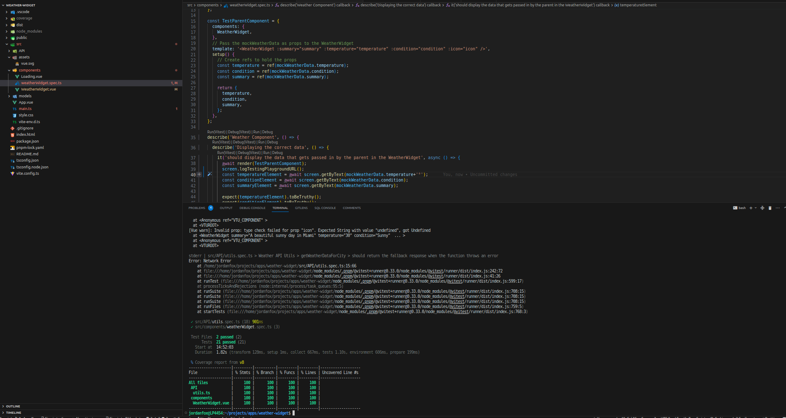

# Weather Widget

### [visit deployed website](https://jordanfox1.github.io/weather-widget/)
### How to start the server locally
* Copy the repo and cd into the root directory

* If pnpm is not installed, install it globally with npm by running `npm i pnpm -g` or by following this [guide](https://pnpm.io/installation)

* install dependencies -  `pnpm i`

* start the server -  `pnpm run dev`

* run the tests -  `pnpm coverage` or `pnpm test`

*Here is the current Test coverage* 
### Potential Improvements
* The icon displaying should be improved to be closer to the actual response. I have tried to handle a bunch of different potential inputs which is not great.

* It doesn't have any loading animation while the data is being fetched which makes it look a bit strange when the DOM suddenly updates after a delay. I should have designed to show a loading animation during the delay time and disable the buttons to stop another API call being made while data is still being fetched.

* I am exposing the API key which is not good. In the real world this would be made a secret and passed into the build.

* This is my first time using Vue and I may be making some mistakes without realizing as a result, please point them out if possible so I can learn from the experience!

* There is a lot more I could have done with the different data, but decided to leave it here because the basic comes across I think.
